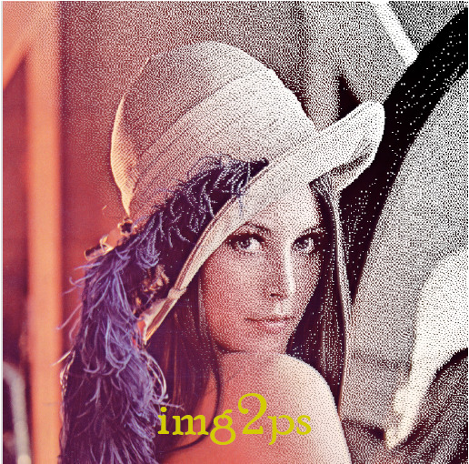

# img2ps -- B/W Dithering Tool (for  troff-based typesetting systems)

Typesetting with `troff/groff` is a joy, as the syntax is simple, yet powerful, and
the macro packets, like `ms` make creating professional looking documents easy
and fast. In addition to that, the `troff/groff` suite offers many clever pre-
processors, like `pic`, `tbl`, `eqn`, `dot` and `grap`, to solve all sorts of
text processing challenges.

However, there is only limited support for embedding images in a troff document.
The preferred method is to use the `.PSPIC` direective, which requires that the
image is stored as a Postscript file (or more precise, and encapsulated Postscript
file, EPS). Only few image processing tools are able to convert a PNG or JPG image
into a Postscript (PS) format. In addition to that, colour printers are still
not available everywhere, and even if, the images printed out directly quite
often lack dynamic and details.

This problem has been around since newspapers first tried to reproduce photographs.
By dithering the image it was possible to simulate gray scales with just black
and white. Over the years, many different methods and algorithms have been developed
to optimise the result in respect of level of detail, dynamic range and avoiding
of repetitive patterns.

**img2ps** is a simple tool that tries to achieve exactly that: Take a
colour or b/w image, render it in a nice way, and produce a Postscript[^1] output
that can be embedded into a `troff/groff` document.

As an additional feature **img2ps** can also store the result as a PNG file: Just
specify the output file name with a `.png` extension. As easy as that!

[^1]: Technically the output is Encapsulated Postscript (EPS). This is really
just a technicality.

## Usage
**img2ps** is a command-line tool. It takes a single image file (either in PNG or Jpeg
format), dithers the image, and emits it as a PostScript (PS) document, either to
stdout or to a file.
In addition, it can also produce a histogram of the luminance distribution in
form of a GRAP file - these files can be processed with the `troff/groff` tool
`grap` and then processed with the `pic` preprocessor.

The syntax is `img2ps [options] `.
For a full list of options and more information about the various parameters
use `img2ps -?`

If the user doesn't specify an output file (with the `-o` option), stdout is
used to emit the Postscript data. It can then piped/directed into any other
processing tool, like `img2ps abc.jpg > othertool`.

**img2ps** has a built-in test-pattern generator that makes calibration a lot
easier; instead of an input image file name, specify `::test` as the input name.

## Building img2ps
**img2ps** uses good old-fashioned `make`. Check out the source code, run `make`
from the root directory, and you should get the application in the `bin` directory.
There is only a single `make` file, and the executable doesn't depend on any
other files or modules. No installer included or required.

The `make` file has various targets:
* `all` (implicit) - builds/rebuilds the application
* `clean` - tidy up temporary files
* `spotless` - tidy up all make-generated files
* `release` - tidy up, rebuild all and run `upx` to pack the executable. Note:
this doesn't **install** the application -- this has to be done by hand, if desired.
* `check` -- optional target, which runs `cppcheck` over the source code. This is
only really relevant if you're applying changes yourself, or if you want to fix
some of the remaining niggles in the code base...

### Linux
Really simple: Just make sure the GCC compiler suite is installed. You also might
want to install `upx` (https://upx.github.io/) to enable compression of the application.
Run `make` as described above.

#### Pre-compiled binary
If you don't want to build your own, [here](rel/img2ps-1.0.0.lin64) is a
pre-compiled version for Linux-64.
Absolutely no promises that it works for you, though.  Ah, and you should rename
it to something sensible, like `img2ps`

### Windows
Building **img2ps** on/for Windows should be easy, provided the right toolkit has been
installed. I do recommend MSYS2 (https://www.msys2.org/), but it should also be
possible to compile under MinGW, together with the original `msys` suite.
The (full) build process also needs `awk` and `upx`. Personally, I prefer the
original Kernighan `awk` version, but any compatible `awk` will do as well.
`upx` is a executable compression program and is available for both Linux and
Windows (https://upx.github.io/).
Microsoft's Visual Studio has not been tested. However, the code-base is written
in a pretty portable style, so it shouldn't be too much of an effort to get it
through that compiler.

#### Pre-compiled binary
If you don't want to build your own, [here](rel/img2ps-1.0.0.win64.exe) is a
pre-compiled version for Windows-64.
Absolutely no promises that it works for you, though. Ah, and you should rename
it to something sensible, like `img2ps.exe`

## Example
Here is an example of various dithering: [testDither.pdf](testDither.pdf).

## Future Features
* Scaling of Source Image -- Putting the scaler into the dithering tool would
allow us to optimise the scaled picture for dithering, rather than apply a generic
scaling that pleases the eye.

## Acknowledgements
**img2ps** uses the following 3rd party software:
* PNG decoder: lodepng (Version 20230410) by Lode Vandevenne.
https://lodev.org/lodepng/ https://github.com/lvandeve/lodepng (zlib License)
* JPEG decoder: jpgd (Release March 25, 2020 ) by Richard Geldreich.
https://github.com/richgel999/jpeg-compressor/tree/master ("Public Domain" license)

The build process requires:
* GNU gcc compiler suite (version 11 or above, C++17 support required)
* System tools like rm, mkdir, cp, awk...
* (optional): upx - file compressor (https://upx.github.io/)
* (optional) cppcheck -  static code analyser (http://cppcheck.net/)

## Reference
* Dithering: https://tannerhelland.com/2012/12/28/dithering-eleven-algorithms-source-code.html
* GRAP files: https://manpages.ubuntu.com/manpages/impish/en/man1/grap.1.html

## License
**img2ps** is made available under the [MIT License](LICENSE).
Copyright (c) 2023 Patric Keller (bozzumdesign at gmail dot com)
